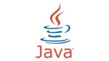

# Simple Java API #

## Local Setup ##

* Install Java 8+, Maven
* mvn clean install
* mvn spring-boot:run

## API Endpoints ##

* http://localhost:7003
* http://localhost:7003/users
* http://localhost:7003/users/bchan

## Docker Setup ##

* mvn clean package
* docker build -t simple-polyglot-java-api:latest --no-cache .
* docker run -d -p 7003:7003 simple-polyglot-java-api
* docker ps -a
