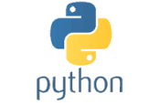

# Simple Python API #

## Local Setup ##

* Install Anaconda
* conda env create -n py37 python=3.7
* condo activate py37
* pip3 install --file requirements.txt
* python app.py

## API Endpoints ##

* http://localhost:7002
* http://localhost:7002/users
* http://localhost:7002/users/bchan

## Docker Setup ##

* docker build -t simple-polyglot-python-api:latest --no-cache .
* docker run -d -p 7002:7002 simple-polyglot-python-api
* docker ps -a
